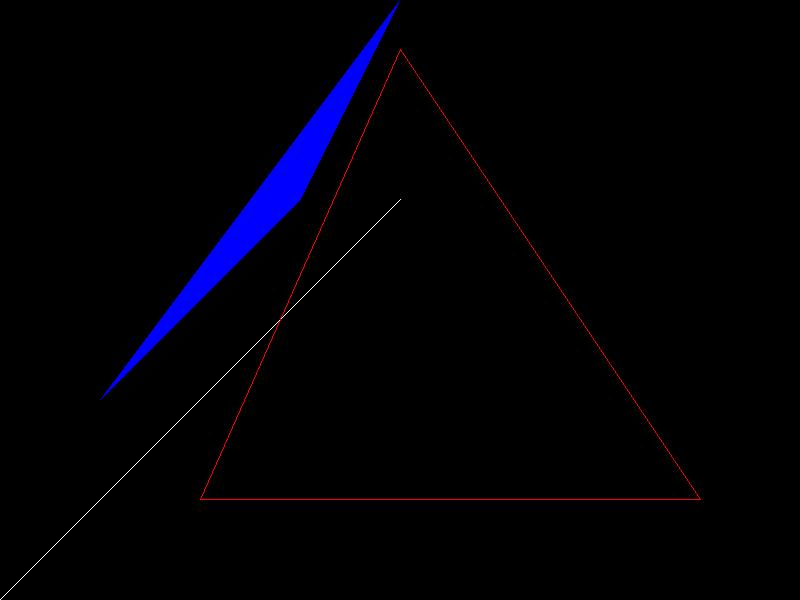

### 第一周目标
实现一个软渲染器。  
目标是尽量不使用第三方库，独立实现整个渲染管线。

### 今日进展
1. 制定了开发计划
2. 进行了技术选型： Window10 + Visual Studio Code + Cmake + C++11  
3. 为减少在无关内容上的消耗，使用了以下开源代码:
    - tga文件输出、obj文件读取
    - 基础的矩阵运算
    - 图像和颜色的数据结构
4. 编写了基础的光栅化代码：
    - 基础代码搭建
    - Bresenham画线算法

