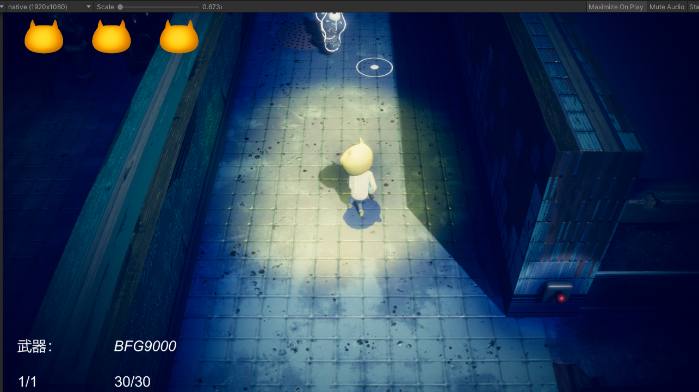
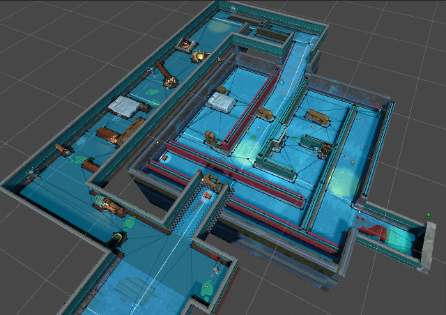

## 一、最初的计划
4-5月，和高中同学组队做了一个游戏，我负责程序，他负责策划和美术————《节奏波波攒》。  

6-7月，打算和同学继续合作参加其他比赛，另外又加入了一位建模的同学，
我们又做了一个俯视角射击游戏，虽然从画面表现到游玩体验都要优于上一款游戏，
但是，这个游戏“不好玩”。
  

***我们理所当然的没有获奖*** 

### 反思
在总结了两个失败项目的教训后，我总结出一些经验：
> **玩法和画面永远排在第一位**  
> **没有人会在乎你写的代码有多优雅**  
> **只会调用接口，永远也成为不了伟大的程序员**

于是我决定结合之前学习过的图形学知识，在小学期内完成一些更加基础的图形工作：
1. 编写一个简易的软渲染器
2. 用现代化的工具打造一个风格化的Demo

## 二、软渲染器
### 第一周目标

实现一个软渲染器。
目标是尽量不使用第三方库，独立实现整个渲染管线。

### 剩下的任务

- 🎈纹理映射
- 🎈Blinn-Pong 光照模型
- 🎈插值算法
- 🎈MVP变换
- 🎈重写整个渲染管线

### 总结  
第一周出现了很多意外情况（秋招、拔牙等...），导致了进度有些落后，但在接受范围之内。
1. C++的技术太过纸上谈兵了。
> 很多C++特性的理解不到位，例如模板、运算符重载、static关键字等，导致了在初期花了太多时间查找资料和选型。
2. 对从零开始一个项目缺乏经验。
> 无论是之前在实验室做的项目还是课程设计，大多都是给出了基础框架，只要编写很少一部分算法实现的代码即可。而这次从零开始制作项目，也让我花了很多时间在学习CMake和C++编译等知识上。
3. 在编写项目过程中又重新复习了一遍图形学和C++的知识。
> 这也让我对这些知识的理解更加深刻了，并且，从无到有一步步看到自己的代码输出“酷炫”的图像，真的是太有成就感了。
