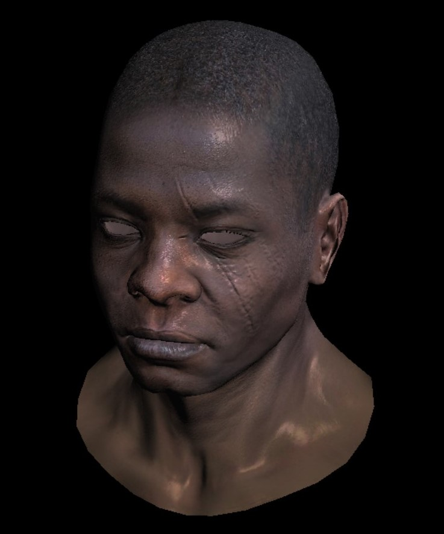

# 第二周总结
## 零、上周进展
  

## 一、透视投影
  

## 二、纹理映射
  

## 三、视图变换
  

## 四、可编程渲染管线 
  

```c++
struct IShader {
    virtual ~IShader();
    virtual Vec4f vertex(int iface, int nthvert) = 0;
    virtual bool fragment(Vec3f bar, TGAColor &color) = 0;
};
```
```c++
struct MyGouraudShader : public IShader {
    Vec3f varying_intensity; // written by vertex shader, read by fragment shader
    mat<2,3,float> varying_uv; 
    Matrix uniform_M;       // Projection*ModelView
    Matrix uniform_MIT;     // Projection*ModelView_invert_transpose

    virtual Vec4f vertex(int iface, int nthvert) {
        varying_uv.set_col(nthvert, model->uv(iface, nthvert));
        varying_intensity[nthvert] = std::max(0.f, model->normal(iface, nthvert)*light_dir); // get diffuse lighting intensity

        Vec4f gl_Vertex = embed<4>(model->vert(iface, nthvert)); // read the vertex from .obj file
        gl_Vertex = Viewport*Projection*ModelView*gl_Vertex;     // transform it to screen coordinates
        return gl_Vertex;
    }

    virtual bool fragment(Vec3f bar, TGAColor &color) {
        float intensity = 1.f;
        // intensity = varying_intensity*bar;   // interpolate intensity for the current pixel
        // intensity = std::floor(intensity*10)/10;
        Vec2f uv = varying_uv*bar;
        Vec3f n = proj<3>(uniform_MIT*embed<4>(model->normal(uv))).normalize();
        Vec3f l = proj<3>(uniform_M*embed<4>(light_dir)).normalize();
        Vec3f r = (n*(n*l*2.f)-l).normalize();
        float spec = pow(std::max(0.f, r.z), model->specular(uv));
        float diff = std::max(0.f, n*l);
        TGAColor c = model->diffuse(uv);
        color = c;
        for(int i=3;i--;){
            color[i] = std::min<float>(5+c[i]*(diff + 0.6*spec),255);
        }
        // color = parse_color("#f0c292")*intensity;          // format: #f09292
        return false;                              // no, we do not discard this pixel
    }
};
```  

## 五、Gouraud shading
  

## 六、更多shader  
  
    
  

## 七、待完成  
1. 阴影  
2. 环境光遮蔽  
3. 抗锯齿  
4. mipmap  
5. etc..  

## 下周的工作：
1. 完善渲染器  
2. 应用案例： 实时体积云  

