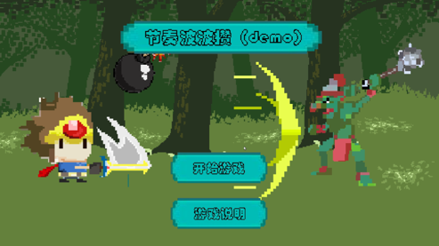
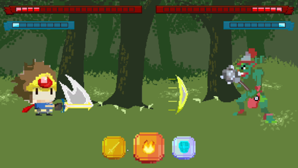

# 《波波攒》项目复盘

## 关于我们的游戏
  
  

以上就是我们游戏所有界面的截图了，真的十分简陋。  

游戏类型是节奏类回合制游戏（可以想象一下节奏地牢），基本游戏机制类似于猜拳，每回合玩家可以选择释放三个招式中的一个：**攒**（集气）、**波**（攻击，需要有气），**防**（挡格攻击）。游戏最终胜利条件是对方损失所有血量。游戏过程中需要根据节奏进行攻击，这个是收到了民间版波波攒（拍手👏、拍手👏、出招🤘）的启发。

以上就是我们的游戏介绍。  

## 复盘

### 一、进度管理 

#### 问题
导致游戏最终成品不佳的原因之一在于糟糕的项目管理。由于团队中只有我和另一位同学，我负责所有的开发工作，另一位同学负责策划和美术，并且由于技术上的鸿沟，我们进行线上交流和合作的效果较差。同时也因为是线上合作的项目，摸鱼也就在所难免，有时是因为学业紧张，有时是因为真的想偷懒。包括我自己，在五月初因为无法返京将要失去offer的情况下，加上考试的双重压力，我实在没动力开发游戏，这也导致了这一整个项目几乎是在五月前的两个礼拜完成的，后续的工作几乎可以浓缩到两天内。

#### 分析
实际上我们立项之初是有用看板软件管理进度的，可惜由于线上沟通不方便，后续便不使用了。当时我们几乎是花了一周时间做好了整个项目的分析，并将每个模块的开发时间都详细列了出来，不过后续执行力实在不太行。这也可以看出在家工作效率是真的低。。。

#### **反思**
1. 加强交流、调整心态
2. 每天（或者定时）做好总结和进度跟踪

### 二、立项

#### 问题
在最开始的策划案中，我们画了很大的饼，甚至在项目仓库我现在还能找到那篇大饼文章，当时技术栈也列了很多，随机生成算法、敌人AI、背包系统等等... 最后看来实现的功能也没多少。虽然这一块的问题也受到了进度管理的影响，不过在这个环节本身仍有很多问题。其一是我们幻想太多，其二对项目的整体规模认识不足。

#### 分析
1. 幻想太多
   - 我们最初从画饼到定下方案一共写了大约三四版策划案，每一版的游戏机制和流程都有改动，虽然改动在所难免，但是我们在一版又一版的策划案中迷失了项目的方向，这在立项初期是很可怕的。  
2. 项目规模
   - 这个错主要在于我，由于要考虑到策划上的大饼，我几乎在每个模块都留出了充足的设计余地，最后的结果就是花了很大时间做的设计最后在项目中根本没有用上，反而导致代码愈发复杂。

#### **反思**
1. 制定可行策划案前可以尝试写几个简单的demo对比效果，虽然会花不少功夫，但是总比后续改动要好很多。
2. 在做设计时要考虑到项目的规模，虽然也要考虑到后续改动，但没必要在每一处都套上设计模式。

### 三、开发

#### 问题
开发过程中遇到的最大问题反而不是技术问题，毕竟方法总比问题多。最大的问题在于美术和音乐资源上，由于我们要做的是一款节奏类游戏，对美术和音乐的要求较高，因为音游主要的爽点就在于**反馈**，而我们团队中没有专业的美术人才，音效也是网上随便找的，这给最终的成品减分不少。

#### 分析
为何会产生这个问题？一是组建团队时考虑不足，二是立项时也没有想到这点。第一个原因无关痛痒，第二个原因才是主要原因，这是因为我们考虑的不够全面，在立项只考虑了核心玩法和技术实现，反而忽略了这方面的需求。

#### **反思**
1. 立项时要全面考虑

### 四、游戏理解
游戏理解主要就是平时玩游戏时的积累了，在开发这个项目期间，我发现我玩游戏时也有了很多变化，比如会经常思考这个功能或者效果是如何做出来的，或者拆解这个游戏的核心设计思路。总之这个项目让我对游戏的理解更加深刻了，如果我们立项之初就能想明白这个项目的核心玩法和设计思路，也不至于走这么多弯路。  
以后还是要多玩、多思考。